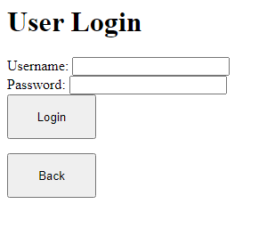
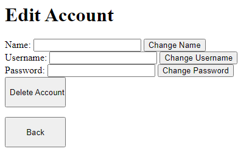

# PTMA: Paper Trading and Market Analysis App
## Table of Contents

1. [Introduction](#introduction)
2. [Requirements](#requirements)
3. [Getting started](#gettingstarted)
4. [API Reference Table](#APIref)
5. [How to Use / Frontend Navigation](#howtouse)
6. [Conclusions](#conclusions)

## Introduction:

This app is a combination paper trading/market analysis utility which scrapes data from Yahoo Finance to allow for pseudo-trading. It additionally connects to a postgres database and logs user credentials, market transactions, balance changes, and holdings.

Main functionality for the app is written and documented in [market_app.py](market_app.py)

Frontend and backend API using the Flask framework is written in [app.py](app.py)

## Requirements:

* Docker
* See [requirements.txt](requirements.txt) for Python-specific requirements

## Getting started:

* Ensure requirements are met, and that any preexisting postgres containers are disabled.
* Open a CLI and navigate to the project's root folder (with docker-compose.yml)
* Execute the command 'docker compose up -d'. This will start the container as well as initialize the database via [database_init.sql](initdb/database_init.sql)
* Confirm that the 'marketapp' container is running in Docker
* In the same directory, execute 'flask run'. This will startup the Flask web framework and host the application on http://127.0.0.1:5000

## API Reference Table:

NOTE: User must be logged in to make any requests beyond the first 2 paths

| Path      | Methods | Parameters     | Description | 
| ---- | ---- | ---- | ---- |
| /api/register      | POST       | username: string, password: string, name: string   | User registration |
| /api/login   | POST       | username: string, password: string     | User login; must be registered |
| /api/user/logout | GET | | Logs user out |
| /api/user | GET | | Displays current user information |
| /api/user | POST | add money: float, remove money: float | Affects user's balance |
| /api/user/edit | PATCH, PUT | username: string, password: string, name: string | Changes user credentials |
| /api/user/edit | DELETE | | Deletes user account from database |
| /api/user/portfolio | GET | | Retrieves user portfolio information |
| /api/user/analysis | POST | market: str (sp500, dow, nasdaq), budget: float, results num: integer (at least 1), aggressive: bool (affects volatility weighting) | Analyzes given index and returns desired amount of top performing stocks |
| /api/user/invest | GET | | Invests from analysis results |
| /api/user/transactions | GET | | Returns list of market transactions made by user |
| /api/user/chart | GET | | Generates graph of user portfolio performance |
| /api/stocks | POST | ticker: string (Valid stock market ticker) | Retrieves current stock data | 
| /api/stocks/buy | POST | ticker: string, amount: integer | Purchases desired amount of stock |
| /api/stocks/sell | POST | ticker: string, amount: integer | Sells desired amount of stock if currently held |
| /api/stocks/data | POST | ticker: string, timeframe: string (1M, 3M, 6M, 9M, 1Y) | Generates graph of stock performance for given timeframe |

## How to Use / Frontend Navigation:

NOTE: The frontend for this app is mainly meant to showcase the program's functionality, and is thus visually simple.
### "/" Homepage:
Pretty straightforward-- Has options to log in and register.

### "/register" User registration:
User can enter desired credentials and the application will register them to the database, as long as the username is not already taken.
Creates a User object with said credentials and runs the register function, which returns a boolean value depending on its success. Also uses bcrypt to hash the user's password for safe storage.

### "/login" User log in:
Standard log in function-- creates ActiveUser object and verifies input against preexisting database values. The logged_in attribute will be set to True if successful.

### "/user" User homepage:
Homepage which shows current balance and holdings value, with the option to add or remove money (uses ActiveUser.add_money and ActiveUser.remove_money functions). Has button links to other pages.

### "/user/edit" Edit user information:
Allows user to change credentials or delete the account. Will log out the user if the username or password is changed.

### "/user/stocks" Access stock information:
Gives the option to select a stock from the nasdaq or user's current holdings. The application retrieves the current price of the selected stock and provides further options to buy, sell or analyze afterward.

A Stock object is created with the selected ticker, and the current price is scraped via the yfinance module.

The selected ticker is stored as a session value for the next few pages.

### "/user/stocks/buy" Purchase stocks:
Allows the user to buy any amount of shares-- user balance must be greater than the total cost. Also displays amount currently held.

### "/user/stocks/sell" Sell stocks:
Allows the user to sell any amount of held shares. The option will not be available if no shares are held.

After buying:

### "/user/stocks/data" Chart stock data:
Outputs a chart detailing the stock's closing price alongside its 21-day moving average and 200-day moving average for the given timeframe.

### "/user/transactions" Show user transactions:
Outputs a table showing all market transactions made by the current user.

### "/user/portfolio" Display user's holdings:
Outputs a table showing the user's current holdings. Allows for the option of charting portfolio growth over time.

### "/user/analysis" Analyze market data and generate a portfolio:
Provides input fields to customize analysis results. After submitting, a Market object is created with the given index, and the inner functions are ran to collect and analyze data. The table is saved as session data and can be selected for investment afterward.

### "/user/invest" Invest from previous analysis:
Takes session data generated from /user/analysis and purchases each stock relative to its final weight in the table.

### "/user/logout" Log out of the session:
Logs out of the interface and clears session data.

#### That's it! For any questions regarding the underlying code, please check out the documentation in [market_app.py](market_app.py).

## Conclusions:

This project, I feel, allowed me to truly start connecting the whole web application process together. There was a lot to learn in each aspect of development--different challenges to overcome in each application tier, so to speak. At the data level, I had very little experience with SQL at the time, so there was a lot of testing, double-checking and confirming along the way. I had originally planned to have at least one of each relationship (one-to-one, one-to-many, many-to-many) implemented. The program's overall functionality, however, shifted the database design in a different direction. In comparing the initial ERD to the pgadmin ERD, it can be noted that the relationships are mainly tied to the user_accounts table. I don't think it's necessarily a bad thing, but for the sake of learning I would like to either add those relationships to the database through additional features, or start a new project in the future where it would be more practical. Moving to the logic tier, things went pretty smoothly. I ended up creating a Python application and then importing that application to the Flask app. This complicated things a little bit, but I had written a lot of code prior to using Flask, and thought it would be more efficient to simply import everything necessary-- seeing how it works, I think I made the right call! Additionally, I ended up going with a raw SQL approach in my Python code, as I wanted more direct experience with the language. Finally, at the presentation level, there was a lot of learning to be done considering I had ambitions to write a basic frontend alongside the REST API. I learned some basic HTML to accomplish this, and coded it in tandem with the API calls so it would make sense. The structure of the frontend isn't ideal, but it works as intended, and is enough to showcase the application's functionality. For the backend, development was relatively straightforward; I'm happy to say I didn't run into many hurdles. So, while I did end up reinventing the wheel a bit with this project, it was nonetheless a fun and valuable experience. I'd like to continue improving it as I grow more as a software developer.
